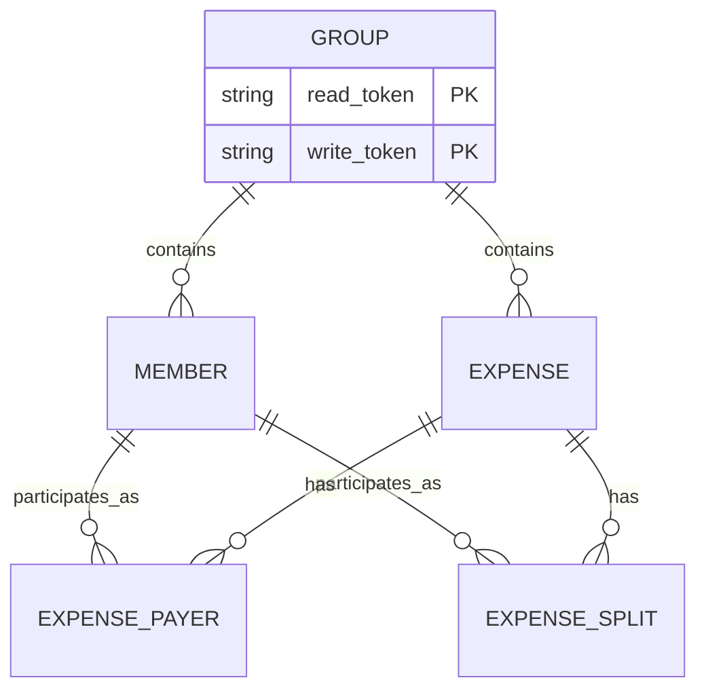

# TeilFair

An open-source expense splitting application that helps groups fairly divide shared costs. It supports custom split ratios, tracks individual payments, and provides a clear overview of outstanding balances so everyone knows who owes whom.

## Features

- **No Registration Required**: Access groups via capability links (tokens) - no user accounts needed
- **Multiple Payers**: Track expenses where multiple people contributed to payment
- **Flexible Splitting**: 
  - Equal splits among members
  - Fixed amount splits
  - Percentage-based splits
  - Custom ratio-based splits (e.g., 2:1 for pro-rata share)
- **Smart Settlements**: Greedy algorithm minimizes the number of transactions needed to settle all debts
- **Cross-Platform**: Web (React + Vite), iOS, and Android (React Native + Expo) with shared TypeScript business logic
- **Lightweight Backend**: Uses Supabase free tier with Row Level Security for token-based access control
- **Real-Time Balance Tracking**: See who owes whom and outstanding balances at a glance
- **Secure Sharing**: Separate read-only and full-access tokens for group sharing

## Architecture

### Tech Stack

**Shared Library** (`@teilfair/shared`):
- TypeScript
- Vitest (testing framework)
- Focuses on calculation logic and data validation

**Web Application** (`@teilfair/web`):
- React 19
- Vite 7 (build tool)
- React Router 7 (routing)
- Zustand (state management)
- Supabase JS client
- FontAwesome (icons)
- Vercel Analytics & Speed Insights

**Mobile Application** (`@teilfair/mobile`):
- React Native 0.83
- Expo 54
- Zustand (state management)
- React Navigation (native stack navigation)
- Async Storage (local persistence)
- Secure Store (sensitive data)
- Supabase JS client

**Backend**:
- Supabase (PostgreSQL database with RLS)
- Row Level Security policies (token-based access)
- UUID generation for secure IDs

### Project Structure

```
teilfair/
├── packages/
│   ├── shared/                 # Shared TypeScript library
│   │   ├── src/
│   │   │   ├── calculations.ts # Core calculation logic
│   │   │   ├── types.ts        # Shared types
│   │   │   └── index.ts
│   │   ├── __tests__/
│   │   └── package.json
│   ├── web/                    # React web application
│   │   ├── src/
│   │   │   ├── components/     # React components
│   │   │   ├── pages/          # Page components
│   │   │   ├── stores/         # Zustand stores
│   │   │   ├── services/       # API/Supabase services
│   │   │   └── App.tsx
│   │   ├── index.html
│   │   └── package.json
│   └── mobile/                 # React Native application
│       ├── src/
│       ├── app.json            # Expo config
│       └── package.json
├── supabase/
│   ├── migrations/             # Database schema and RLS policies
│   │   ├── 000_reset.sql
│   │   ├── 001_initial_schema.sql
│   │   └── 002_change_expense_date_to_timestamptz.sql
│   └── config.toml
├── pnpm-workspace.yaml         # Monorepo workspace config
└── package.json
```

### Security Model

TeilFair uses **capability-based security** instead of user accounts:

- Each group has two tokens: `readToken` and `writeToken`
- Share the read link for view-only access
- Share the write link for full edit access
- Tokens are validated via Supabase Row Level Security
- Groups cannot be guessed (cryptographically random IDs and tokens)

## Getting Started

### Prerequisites

- Node.js 24 or higher
- pnpm 10.4+
- A Supabase project (free tier works)
- For mobile development: Expo CLI
- For iOS development: Xcode
- For Android development: Android Studio

### 1. Clone and Install

```bash
git clone https://github.com/your-username/teilfair.git
cd teilfair
pnpm install
```

### 2. Set Up Supabase

1. Create a new project at [supabase.com](https://supabase.com) (free tier is fine)
2. Navigate to the SQL Editor
3. Create a new query and copy the contents of `supabase/migrations/001_initial_schema.sql`
4. Paste and execute the SQL
5. In Settings > API, copy:
   - **Project URL**: `https://[project-id].supabase.co`
   - **Anon Public Key**: The public API key
   - **Service Role Key**: Keep this safe, only for backend use

### 3. Configure Environment Variables

**For Web** (`packages/web/.env`):
```
VITE_SUPABASE_URL=https://your-project.supabase.co
VITE_SUPABASE_ANON_KEY=your-anon-key
```

Create the file if it doesn't exist:
```bash
cd packages/web
cat > .env << EOF
VITE_SUPABASE_URL=https://your-project.supabase.co
VITE_SUPABASE_ANON_KEY=your-anon-key
EOF
```

**For Mobile** (`packages/mobile/.env`):
```
EXPO_PUBLIC_SUPABASE_URL=https://your-project.supabase.co
EXPO_PUBLIC_SUPABASE_ANON_KEY=your-anon-key
```

### 4. Run Development Servers

**Web** (recommended to start here):
```bash
pnpm web
# Opens at http://localhost:5173
```

**Mobile** (requires Expo Go app on your phone):
```bash
pnpm mobile
# Scan the QR code with Expo Go app
```

**Run Tests**:
```bash
pnpm test
```

**Build All Packages**:
```bash
pnpm build
```

### Troubleshooting

**`pnpm install` fails or missing dependencies**
- Delete `pnpm-lock.yaml` and `node_modules/`
- Clear pnpm store: `pnpm store prune`
- Run `pnpm install` again

**Web dev server won't start**
- Ensure `.env` file exists in `packages/web/` with valid Supabase credentials
- Check that port 5173 is not in use
- Try: `pnpm web -- --port 3000` to use a different port

**Mobile app won't connect to backend**
- Verify `.env` in `packages/mobile/` has correct Supabase URL and key
- Ensure your phone and dev machine are on the same network
- Try restarting the Expo dev server

**RLS policy errors on Supabase**
- Confirm all migrations from `supabase/migrations/` were run in order
- Check that RLS is enabled on all tables
- Verify the `x-group-token` header is being sent with requests

**"Cannot find module" errors**
- Run `pnpm install` from the root directory
- Clear TypeScript cache: `rm -rf packages/*/dist`
- Restart your IDE

## API / Data Model

### Database Schema

TeilFair uses a PostgreSQL database with the following core tables:

### Groups
Represents a group of people sharing expenses.

| Column | Type | Description |
|--------|------|-------------|
| `id` | UUID | Primary key, auto-generated |
| `name` | TEXT | Group name (e.g., "Roommates", "Trip to Greece") |
| `currency` | TEXT | ISO currency code (EUR, USD, GBP, etc.) |
| `read_token` | TEXT | Token for read-only access (32+ chars, unique) |
| `write_token` | TEXT | Token for full edit access (32+ chars, unique) |
| `created_at` | TIMESTAMPTZ | When the group was created |

**Relationships**: One-to-many with Members, Expenses

### Members
People who are part of a group and can participate in expenses.

| Column | Type | Description |
|--------|------|-------------|
| `id` | UUID | Primary key, auto-generated |
| `group_id` | UUID | Foreign key to `groups` |
| `name` | TEXT | Member name (e.g., "Alice", "Bob") |
| `created_at` | TIMESTAMPTZ | When the member was added |

**Relationships**: Many-to-one with Groups; One-to-many with ExpensePayers and ExpenseSplits

### Expenses
Tracks shared expenses and how they were paid/split.

| Column | Type | Description |
|--------|------|-------------|
| `id` | UUID | Primary key, auto-generated |
| `group_id` | UUID | Foreign key to `groups` |
| `description` | TEXT | What the expense was for (e.g., "Groceries") |
| `total_amount` | DECIMAL(12,2) | Total cost (must be > 0) |
| `expense_date` | DATE | When the expense occurred |
| `created_at` | TIMESTAMPTZ | When created |

**Relationships**: Many-to-one with Groups; One-to-many with ExpensePayers and ExpenseSplits

### ExpensePayers
Records who paid for an expense and how much they paid.

| Column | Type | Description |
|--------|------|-------------|
| `id` | UUID | Primary key, auto-generated |
| `expense_id` | UUID | Foreign key to `expenses` |
| `member_id` | UUID | Foreign key to `members` |
| `amount` | DECIMAL(12,2) | Amount this person paid (must be > 0) |

**Constraints**: 
- One person can only be listed once per expense
- Must sum to total expense amount

**Relationships**: Many-to-one with Expenses and Members

### ExpenseSplits
Records how an expense should be split among members (who owes what).

| Column | Type | Description |
|--------|------|-------------|
| `id` | UUID | Primary key, auto-generated |
| `expense_id` | UUID | Foreign key to `expenses` |
| `member_id` | UUID | Foreign key to `members` |
| `share` | DECIMAL(12,4) | The share value (meaning depends on `share_type`) |
| `share_type` | TEXT | One of: `'ratio'`, `'fixed'`, `'percentage'` |

**Share Types**:
- `ratio`: Proportional share (e.g., Alice:1, Bob:2 means Alice pays 1/3, Bob pays 2/3)
- `fixed`: Fixed amount (e.g., Alice:10.50 means Alice owes exactly €10.50)
- `percentage`: Percentage of total (e.g., Alice:50 means Alice owes 50% of total)

**Relationships**: Many-to-one with Expenses and Members

### Data Relationships



### Access Control via Row Level Security (RLS)

All tables have RLS enabled. Access is controlled via the `x-group-token` HTTP header:

- **Read Token**: Can view group data
- **Write Token**: Can view and modify group data

The `check_group_access()` function in Supabase validates tokens before allowing any database operation.

## Calculation Logic

The calculation engine (in `packages/shared/src/calculations.ts`) handles:

1. **Split Types**:
   - `ratio`: Divide proportionally (e.g., 1:1:1 = equal, 2:1 = 2/3 and 1/3)
   - `fixed`: Exact amounts
   - `percentage`: Percentage of total

2. **Settlement Optimization**:
   Uses a greedy algorithm to minimize the number of transactions needed to settle all debts.

## Contributing

1. Fork the repository
2. Create a feature branch
3. Make your changes
4. Run tests: `npm test`
5. Submit a pull request

## License

MIT
